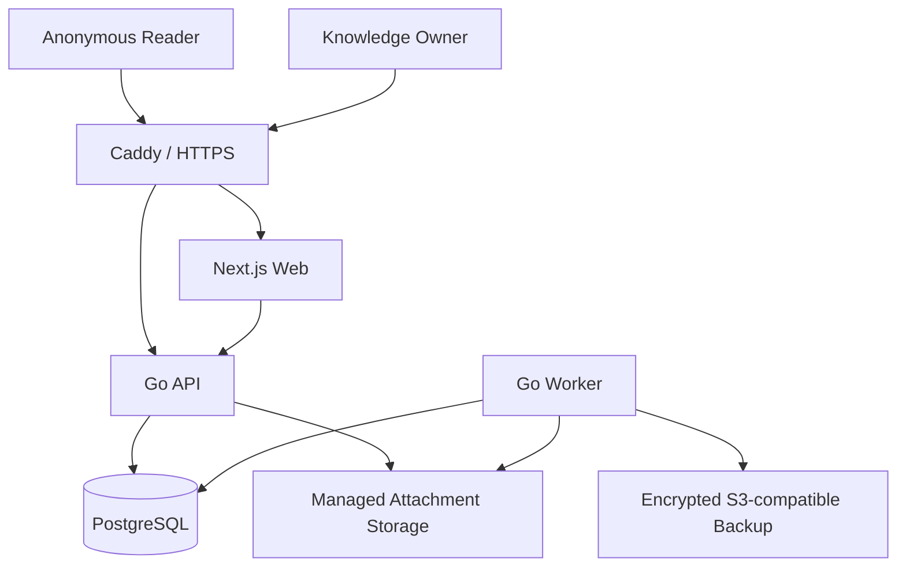
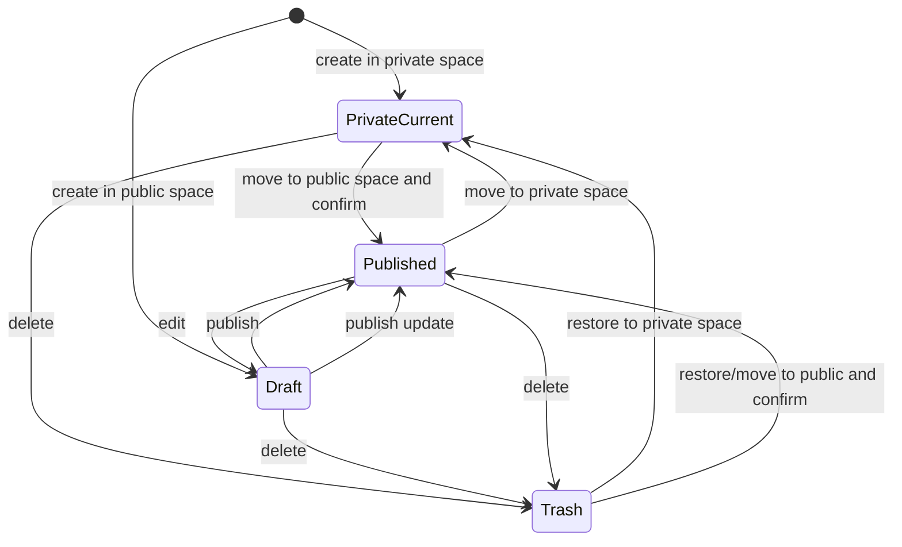

# Personal Learning Workspace — Architecture

## System shape

The system starts as a Go modular monolith with a Next.js frontend, PostgreSQL, and a worker built from the same Go codebase.



## Backend modules

```text
internal/
├── identity/       # GitHub OAuth and owner session
├── knowledge/      # spaces, directories, tags, note links
├── notes/          # current content, drafts, revisions, publishing
├── sources/        # v0.2 inbox, metadata, extraction
├── search/         # projections and queries
├── attachments/    # ownership, visibility, storage keys
├── jobs/           # durable asynchronous work
└── backup/         # backup creation, encryption, upload, restore
```

Each module owns its domain rules, application operations, persistence adapters, HTTP handlers, and tests. Modules do not directly mutate each other's tables.

## Note lifecycle



Autosave updates current working content frequently. Note Revisions are created at meaningful checkpoints such as publish, approved Agent changes, restore, manual checkpoints, and bounded periodic checkpoints.

## Persistence

- PostgreSQL is the runtime system of record for canonical Markdown and all metadata.
- Binary attachments live in a managed persistent directory and are addressed through immutable storage keys.
- Markdown export converts stable internal Note identities into portable relative links.
- Search documents and indexes are rebuildable projections, never the source of truth.

## Search

- Weighted PostgreSQL `tsvector` indexes title, tags, headings, and body.
- `pg_trgm` complements it for Chinese sequences, substring matches, and similarity fallback.
- Owner search includes all authorized content; anonymous search is restricted to published notes in public spaces.
- Search filters are applied by Knowledge Space, content type, and Tag.

## Background work

PostgreSQL-backed Jobs execute slow or retryable tasks. v0.1 uses this mechanism for scheduled backups; v0.2 adds web extraction and PDF parsing. The worker claims persisted jobs, records attempts and failures, and survives process restarts. No external message broker is required.

## Deployment

Docker Compose runs:

- Caddy for routing and automatic HTTPS.
- Next.js for management and public knowledge-base pages.
- Go API for REST/OpenAPI and protected attachment access.
- Go Worker from the same backend image.
- PostgreSQL.
- Persistent volumes for PostgreSQL, attachments, and Caddy state.

## Security boundaries

- Only the configured immutable GitHub User ID can become the Knowledge Owner.
- Public visibility is inherited from the target Knowledge Space.
- Moving private content into a public space requires one confirmation and publishes it in the same action.
- Learning Sources, drafts, revisions, management APIs, and private attachments are never public or indexable.
- Public pages may expose source citation metadata and original URLs, never captured copies or internal files.

