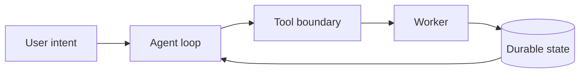

# Architecture and Runtime

Hermes uses a small runtime that separates planning, tool execution, and durable state. The database remains the source of truth while workers claim durable jobs.

The diagram attachment is managed by NoteFoundry and becomes public only when this Published Content references it.

Return to the [Hermes Agent overview](note:{{OVERVIEW_ID}}).
