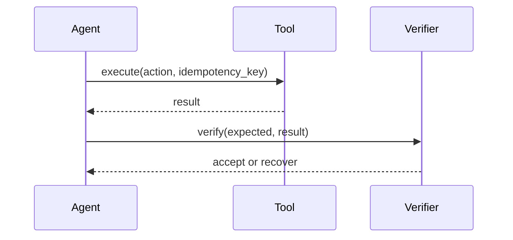

# Reliability and Evaluation

Reliability is measured across complete trajectories, not isolated model responses. A useful evaluation records the starting state, chosen actions, tool results, final state, and any recovery attempt.

An evaluation suite should include transient failures, stale versions, duplicate delivery, and permission denial. The [Hermes Agent overview](note:{{OVERVIEW_ID}}) keeps these findings connected to the rest of the study.
